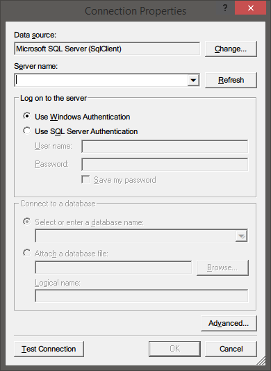

# New-SqlConnectionDialog

## SYNOPSIS
Permite a los usuarios crear cadenas de conexión a través de un cuadro de dialogo.

## SYNTAX

```powershell
New-SqlConnectionDialog [[-RequiresSelection] <Boolean>] [-RequiresSysAdmin]
```

## DESCRIPTION
Permite a los usuarios crear cadenas de conexión y conectarse a fuentes de datos de SQL Server.



## EXAMPLES

### -------------------------- EXAMPLE 1 --------------------------
```powershell
New-SqlConnectionDialog
```

### -------------------------- EXAMPLE 2 --------------------------
```powershell
New-SqlConnectionDialog -RequiresSysAdmin
```

## PARAMETERS

### -RequiresSelection
Establece si se requiere que el usuario cree una cadena de conexión de forma obligatoria.

```yaml
Type: Boolean
Parameter Sets: (All)
Aliases: 

Required: False
Position: 1
Default value: True
Accept pipeline input: False
Accept wildcard characters: False
```

### -RequiresSysAdmin
Establece si se debe validar que la cadena de conexión utilice un usuario en el grupo de Administradores de SQL Server.

```yaml
Type: SwitchParameter
Parameter Sets: (All)
Aliases: 

Required: False
Position: Named
Default value: False
Accept pipeline input: False
Accept wildcard characters: False
```

## INPUTS

None

## OUTPUTS

String con una cadena de conexión que apunta a una base de datos de SQL Server.

## NOTES
Autor: Atorres

## RELATED LINKS

[New-QueryPickerDialog](New-QueryPickerDialog.md)


