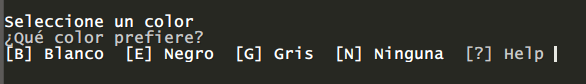

# Read-UserChoice

## SYNOPSIS
Proporciona un conjunto de opciones, que permiten al usuario elegir una sola opción de dicho conjunto.

## SYNTAX

### CustomSet (Default)
```
Read-UserChoice -Title <String> -Prompt <String> -Option <PSObject[]> [-Default <Int32>]
 [-NoneElement <PSObject>]
```

### ChoiceSet
```
Read-UserChoice -Title <String> -Prompt <String> -Choice <ChoiceDescription[]> [-Default <Int32>]
 [-NoneElement <PSObject>]
```

## DESCRIPTION
El carácter especial "&" (ampersand) se puede integrar en el texto de la pantalla para indicar que el carácter siguiente es una tecla de acceso rápido.



## EXAMPLES

### -------------------------- EXAMPLE 1 --------------------------
```
$Options = @()
$Options += New-Object -TypeName System.Management.Automation.Host.ChoiceDescription -ArgumentList '&Blanco', 'Blanco en Hex es #ffffff'
$Options += New-Object -TypeName System.Management.Automation.Host.ChoiceDescription -ArgumentList 'N&egro', 'Negro en Hex es #000000'
$Options += New-Object -TypeName System.Management.Automation.Host.ChoiceDescription -ArgumentList '&Gris', 'Gris en Hex es #808080'

$SelectedIndex = ('Seleccione un color' | Read-UserChoice -Prompt '¿Qué color prefiere?' -Option $Options)
$SelectedIndex | Out-Default
```

### -------------------------- EXAMPLE 2 --------------------------
```
$Options = @()
$Options += @{Label = '&Mucho'; HelpMessage = 'Bien'}
$Options += @{Label = 'M&uchisimo'; HelpMessage = 'Yupi!!!'}
$Options += @{Label = 'Na&da'; HelpMessage = 'Carita triste'}

$SelectedIndex = ('En el mes de amor y amistad...' | Read-UserChoice -Prompt '¿Me quieres?' -Option $Options)
$SelectedIndex | Out-Default
```

## PARAMETERS

### -Title
El texto que precede (un título) las opciones.

```yaml
Type: String
Parameter Sets: (All)
Aliases: 

Required: True
Position: Named
Default value: None
Accept pipeline input: True (ByValue)
Accept wildcard characters: False
```

### -Prompt
Un mensaje que describe la elección.

```yaml
Type: String
Parameter Sets: (All)
Aliases: 

Required: True
Position: Named
Default value: None
Accept pipeline input: False
Accept wildcard characters: False
```

### -Choice
Colección de objetos que describen cada opción.

```yaml
Type: ChoiceDescription[]
Parameter Sets: ChoiceSet
Aliases: 

Required: True
Position: Named
Default value: None
Accept pipeline input: False
Accept wildcard characters: False
```

### -Option
Colección de objetos que describen cada opción. Cada objeto debe tener una propiedad Label y HelpMessage.

```yaml
Type: PSObject[]
Parameter Sets: CustomSet
Aliases: 

Required: True
Position: Named
Default value: None
Accept pipeline input: False
Accept wildcard characters: False
```

### -Default
El índice del elemento predeterminado de la etiqueta en la colección de parámetros de opciones. Para no indicar una opción predeterminada establezca -1.

```yaml
Type: Int32
Parameter Sets: (All)
Aliases: 

Required: False
Position: Named
Default value: -1
Accept pipeline input: False
Accept wildcard characters: False
```

### -NoneElement
Cuando se establece, agrega un elemento de salida a la lista de opciones.

```yaml
Type: PSObject
Parameter Sets: (All)
Aliases: 

Required: False
Position: Named
Default value: @{Label = '&Ninguna';HelpMessage = 'Ninguna opción'}
Accept pipeline input: False
Accept wildcard characters: False
```

## INPUTS
Puede canalizar el valor de Prompt.

## OUTPUTS

El índice del elemento que corresponde con la opción seleccionada por el usuario (int).

## NOTES
Autor: Atorres

## RELATED LINKS

